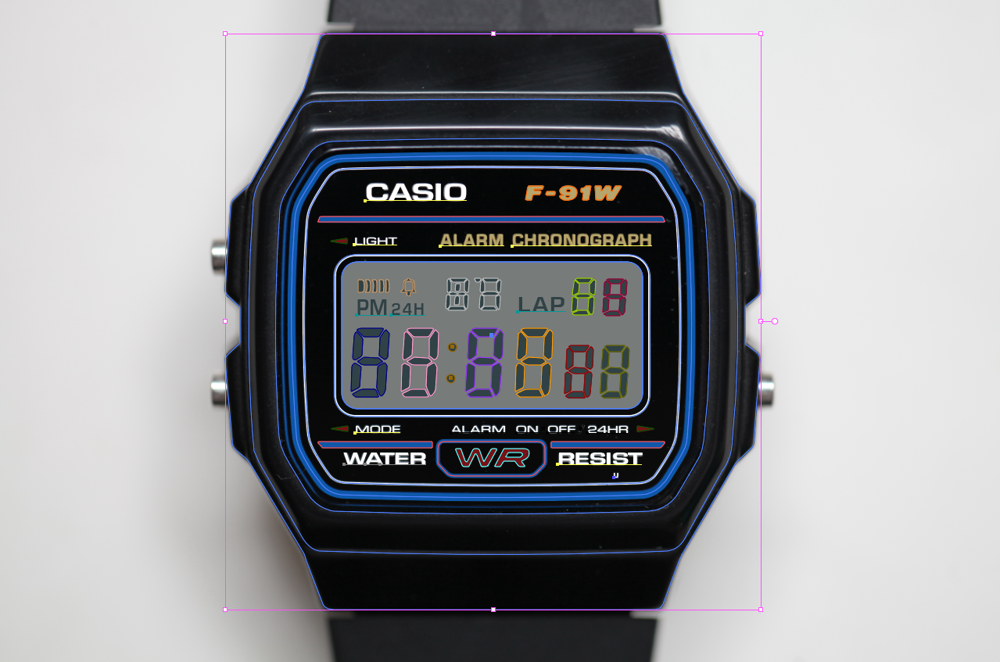
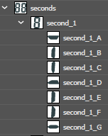

# Casio F-91W

URL: https://www.alexisphilip.fr/demo/Casio-F-91W/

The legendary F-91W now has its online version,
and it's fully functional. Have fun. 

> Warning: all the comments in the source code are written in French, as I wrote this code a long time ago, not thinking
> it could be used by people throughout the world.

## Why ?

I am a big fan of the Casio F-91W. Its simplicity, lightness, long-lasting battery life, toughness, make it
special to me.

I have been wearing it for years now. But when I realized no one bothered to make an online version of it (in case
you forgot yours at home, frightening right?), I decided to go on with this project and make it myself.

## How I made it

First, I took a macro close-up of my F-91W.


Then, I contoured and created all the shapes in Adobe Illustrator.

By this, I mean all the elements of the watch, e.i.:
- the screen;
- the words;
- the 7, 8 and 9 segments displays;
- etc.



Then, I exported the shapes as an SVG file so I could work on the colouring of all the elements.


The next step is to rename all of the interactive elements with a unique ID - so JavaScript can select it and
interact with it.

ID assignation of the **unit** **second** display. Here is the shape's path:

```text
seconds            - Selects the "seconds" group of elements
    second_1       - Selects the "seconds unit" group of elements (not the tenth).
        second_1_A - Selects the A segment of the display
        second_1_B - Selects the B segment of the display
        ...
```

Illustrator's layer path of the **unit** **second** display:



Here, each element of the 7 display segment is assigned with a letter. This way, I will be able to manually interact with 
each element of the display (hours, minutes, seconds, modes...).

Then I exported the SVG and interacted with it in JS. The code is available for you in the repository.

## License

This project is licensed under the [MIT License](https://choosealicense.com/licenses/mit/) - see the LICENSE.md file for details.

## Author

Alexis Philip ([Website](https://alexisphilip.fr)). 
 